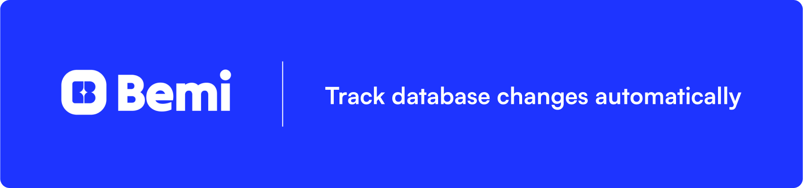
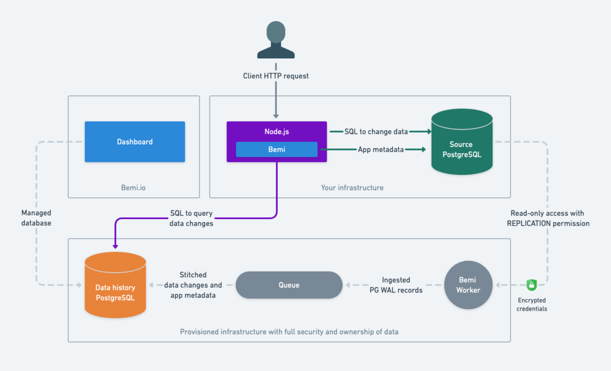

<!-- PROJECT LOGO -->
<br />
<div align="center">
  <a href="https://bemi.io">
    
  </a>

  <p align="center">
    <a href="https://bemi.io">Website</a>
    ·
    <a href="https://docs.bemi.io">Docs</a>
    ·
    <a href="https://github.com/BemiHQ/prisma-example">Example</a>
    ·
    <a href="https://github.com/BemiHQ/prisma/issues/new">Report Bug</a>
    ·
    <a href="https://github.com/BemiHQ/prisma/issues/new">Request Feature</a>
    ·
    <a href="https://discord.gg/mXeZ6w2tGf">Discord</a>
    ·
    <a href="https://twitter.com/BemiHQ">Twitter</a>
    ·
    <a href="https://www.linkedin.com/company/bemihq/about">LinkedIn</a>
  </p>
</div>

[](https://opensource.org/licenses/MIT)

# Bemi

[Bemi](https://bemi.io) plugs into [Prisma](https://github.com/prisma/prisma) and PostgreSQL to track database changes automatically. It unlocks robust context-aware audit trails and time travel querying inside your application.

Designed with simplicity and non-invasiveness in mind, Bemi doesn't require any alterations to your existing database structure. It operates in the background, empowering you with data change tracking features.

This library is an optional Prisma integration, enabling you to pass application-specific context when performing database changes. This can include context such as the 'where' (API endpoint, worker, etc.), 'who' (user, cron job, etc.), and 'how' behind a change, thereby enriching the information captured by Bemi.

## Contents

- [Highlights](#highlights)
- [Use cases](#use-cases)
- [Quickstart](#quickstart)
- [Architecture overview](#architecture-overview)
- [License](#license)

## Highlights

- Automatic and secure database change tracking with application-specific context in a structured form
- 100% reliability in capturing data changes, even if executed through direct SQL outside the application
- High performance without affecting code runtime execution and database workload
- Easy-to-use without changing table structures and rewriting the code
- Time travel querying and ability to easily group and filter changes
- Scalability with an automatically provisioned cloud infrastructure
- Full ownership of your data

See [an example repo](https://github.com/BemiHQ/prisma-example) for Prisma that automatically tracks all changes.

## Use cases

There's a wide range of use cases that Bemi is built for! The tech was initially built as a compliance engineering system for fintech that supported $15B worth of assets under management, but has since been extracted into a general-purpose utility. Some use cases include:

- **Audit Trails:** Use logs for compliance purposes or surface them to customer support and external customers.
- **Change Reversion:** Revert changes made by a user or rollback all data changes within an API request.
- **Time Travel:** Retrieve historical data without implementing event sourcing.
- **Troubleshooting:** Identify the root cause of application issues.
- **Distributed Tracing:** Track changes across distributed systems.
- **Testing:** Rollback or roll-forward to different application test states.
- **Analyzing Trends:** Gain insights into historical trends and changes for informed decision-making.

## Quickstart

Install the NPM package

```sh
npm install @bemi-db/prisma
```

Enable native [Node.js PostgreSQL adapter](https://github.com/brianc/node-postgres) for your Prisma client by wrapping it into `withPgAdapter`

```ts
import { withPgAdapter } from "@bemi-db/prisma";
import { PrismaClient } from '@prisma/client';

const prisma = withPgAdapter(new PrismaClient());
```

Add an [Express](https://expressjs.com/) middleware to pass application context with automatically tracked database changes

```ts
import { setContext } from "@bemi-db/prisma";
import { Request } from "express";
import { prisma } from "./prisma";

const app = express();

app.use(
  setContext(prisma, (req: Request) => ({
    // Customizable context
    userId: req.user?.id,
    apiEndpoint: req.url,
    params: req.body,
  }))
);
```

Make database changes and make sure they're all stored in a table called `changes`

```
psql -h us-west-1-prod-destination-pool.ctbxbtz4ojdc.us-west-1.rds.amazonaws.com -p 5432 -U u_9adb30103a55 -d db_9adb30103a55 -c \
  'SELECT "primary_key", "table", "operation", "values", "context", "committed_at" FROM changes;'
Password for user u_9adb30103a55:

 primary_key | table | operation |                       values                       |                                context                                                         |      committed_at
-------------+-------+-----------+----------------------------------------------------+------------------------------------------------------------------------------------------------+------------------------
 26          | todo  | CREATE    | {"id": 26, "task": "Sleep", "isCompleted": false}  | {"userId": 187234, "apiEndpoint": "/todo", "params": {"task": "Sleep", "isCompleted": false}}  | 2023-12-11 17:09:09+00
 27          | todo  | CREATE    | {"id": 27, "task": "Eat", "isCompleted": false}    | {"userId": 187234, "apiEndpoint": "/todo", "params": {"task": "Eat", "isCompleted": false}}    | 2023-12-11 17:09:11+00
 28          | todo  | CREATE    | {"id": 28, "task": "Repeat", "isCompleted": false} | {"userId": 187234, "apiEndpoint": "/todo", "params": {"task": "Repeat", "isCompleted": false}} | 2023-12-11 17:09:13+00
 26          | todo  | UPDATE    | {"id": 26, "task": "Sleep", "isCompleted": true}   | {"userId": 187234, "apiEndpoint": "/todo/complete", "params": {"id": 26}}                      | 2023-12-11 17:09:15+00
 27          | todo  | DELETE    | {}                                                 | {"userId": 187234, "apiEndpoint": "/todo/27", "params": {"id": 27}}                            | 2023-12-11 17:09:18+00
```

Check out our [Prisma Docs](https://docs.bemi.io/orms/prisma) for more details.

## Architecture overview

Bemi is designed to be lightweight and secure. It takes a practical approach to achieving the benefits of [event sourcing](https://martinfowler.com/eaaDev/EventSourcing.html) without requiring rearchitecting existing code, switching to highly specialized databases, or using unnecessary git-like abstractions on top of databases. We want your system to work the way it already does with your existing database to allow keeping things as simple as possible.

Bemi plugs into both the database and application levels, ensuring 100% reliability and a comprehensive understanding of every change.

On the database level, Bemi securely connects to PostgreSQL's [Write-Ahead Log](https://www.postgresql.org/docs/current/wal-intro.html)'s and implements [Change Data Capture](https://en.wikipedia.org/wiki/Change_data_capture). This allows tracking even the changes that get triggered via direct SQL.

On the application level, this package automatically passes application context by using a [Prisma extension](https://www.prisma.io/docs/orm/prisma-client/client-extensions) to the replication logs to enhance the low-level database changes. For example, information about a user who made a change, an API endpoint where the change was triggered, a worker name that automatically triggered database changes, etc.

Bemi workers then stitch the low-level data with the application context and store this information in a structured easily queryable format, as depicted below:



The cloud solution includes worker ingesters, queues for fault tolerance, and an automatically scalable cloud-hosted PostgreSQL. Bemi currently doesn't support a self hosted option, but [contact us](mailto:hi@bemi.io) if this is required.

## License

Distributed under the terms of the [MIT License](http://opensource.org/licenses/MIT).
